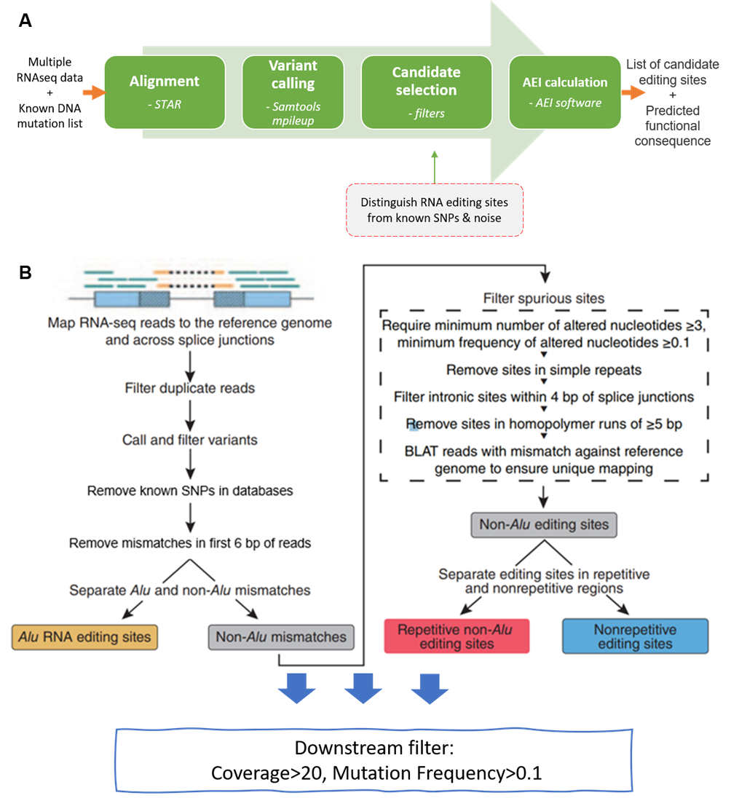

# RNA-editing-from-RNAseq
A shell pipeline for RNA-editing site identification from RNA-seq data only

## Introduction
RNA editing is a post-transcriptional modification to alter the sequence of RNA molecules
while keeping the original DNA sequence unchanged. This is a shell pipeline used in linux server to extract the valid RNA-editing site from RNA-seq data. The overall pipeline is adopted from [CSI NUS Portal](https://csibioinfo.nus.edu.sg/csingsportal/docs/#rnaediting) and [Ramaswami's pipeline (2013)](https://www.nature.com/articles/nmeth.2330) with a series of filters to exclude the technical biases.

## Overall Workflow

  

## Files

* [reference_file_download.sh](./reference_file_download.sh) includes all reference files used in this pipeline.
* [SRA_workflow_full.sh](./SRA_workflow_full.sh) is the main pipeline that cover the entire analyzing and filtering process.
* [perlCode](./perlCode/) repository keeps the specific filtering procedure that is written in perl document and was excuted in the overall workflow file.

## Final report

The pipeline is applied in my undergraudate thesis: [Investigating the role of ADAR-mediated RNA-editing in Cardiomyopathy](./files/Dissertation.pdf).

## Acknowledgement

I would like to acknowledge Prof Roger Foo's supervise, guidance, and direction suggestions
on this project, Dr Willson Tan, and Dr LEE Chang Jie Mick's suggestions in bioinformatics pipeline 
establishment and improvement. Also, I would like to thank Prof Polly Chen and her postdoc Dr Omer 
An's support for providing CSI bioinformatic portal and their related pipeline documents, Prof Gokul 
Ramaswami for providing the original RNA-editing pipeline codes. Thanks to Professor Robert Young 
for being my link-supervisor, giving me frequent supervising on my project progress, and providing 
access and technical support for the use of the UoE Eddie Remote Server.
